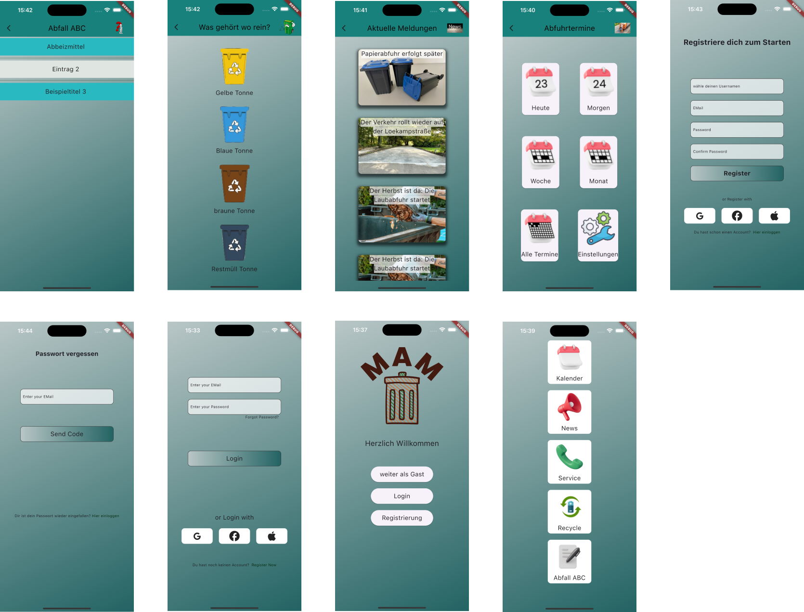

# mam_projekt_v1

Hier entsteht die Müll App Marl
Das ist die erste Version mit GUI. Zurzeit werden die Screens gecodet. Ihr werdet bald Screenshots bekommen.
##
Die grundlegenden Screens sind hinzugefügt. Die Navigation zu den Hauptscreens ist implementiert.
Grundlegende Grafiken sind als Platzhalter eingefügt. 
Somit ist bis hierhin die Richtung dr App erkennbar.

